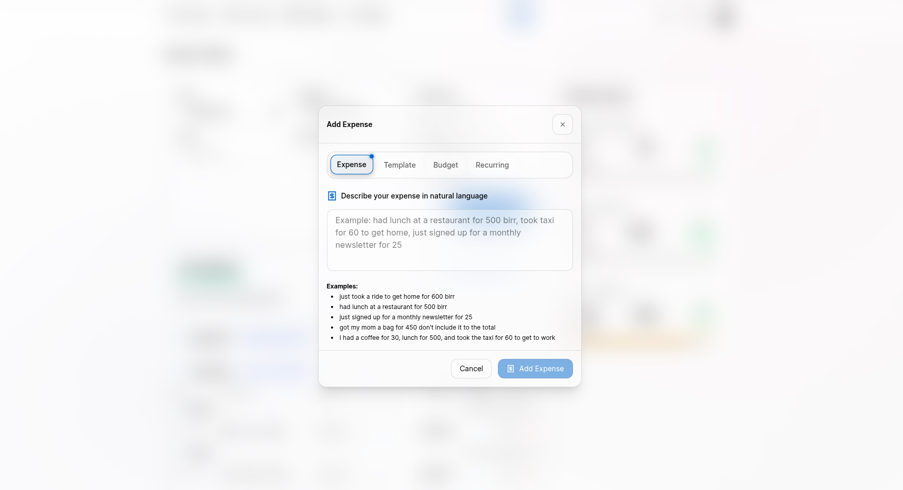
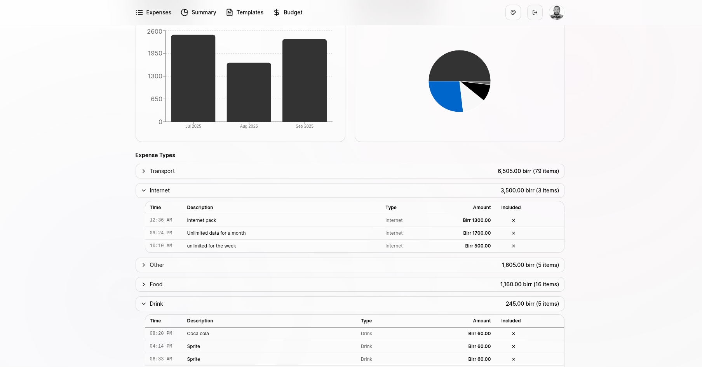
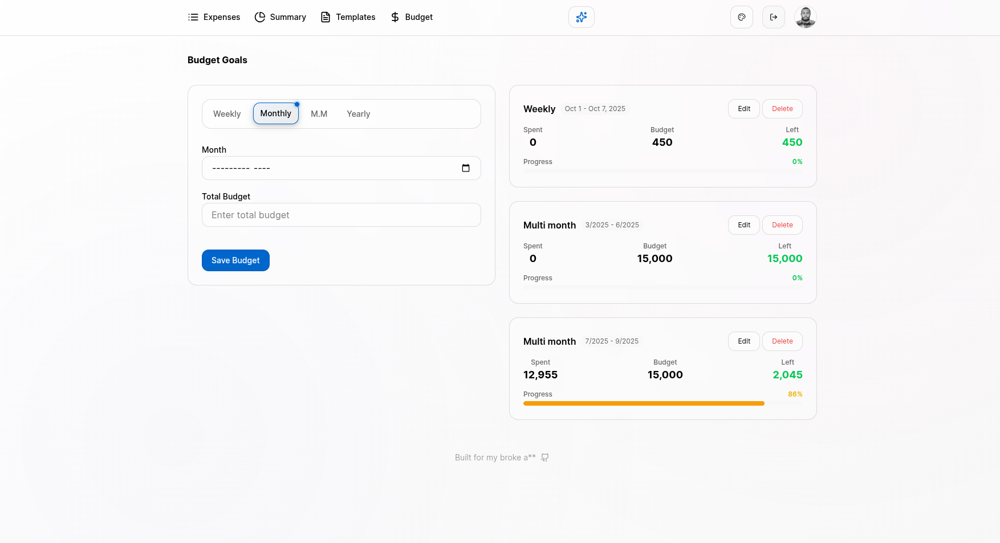
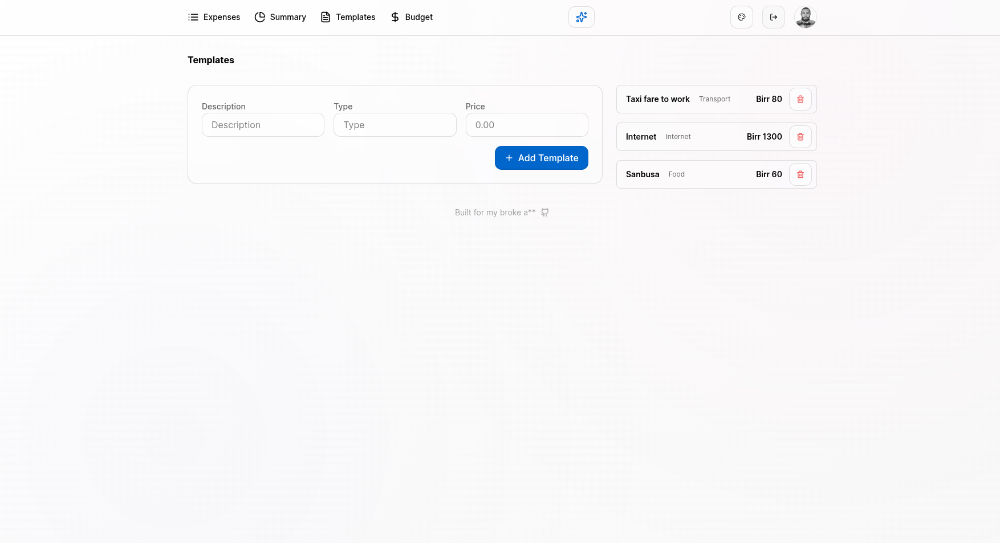
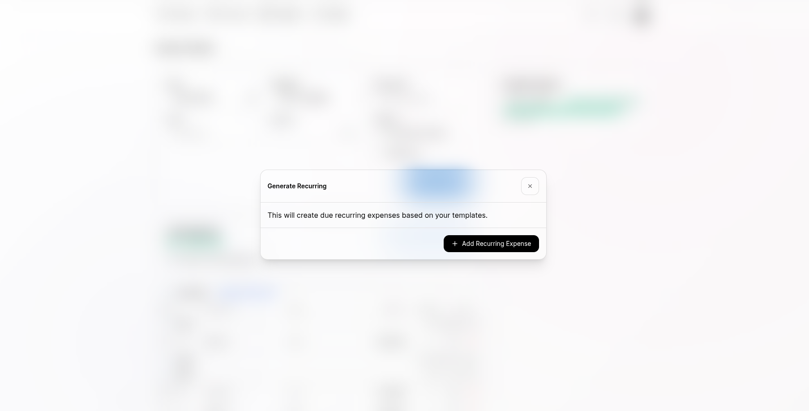
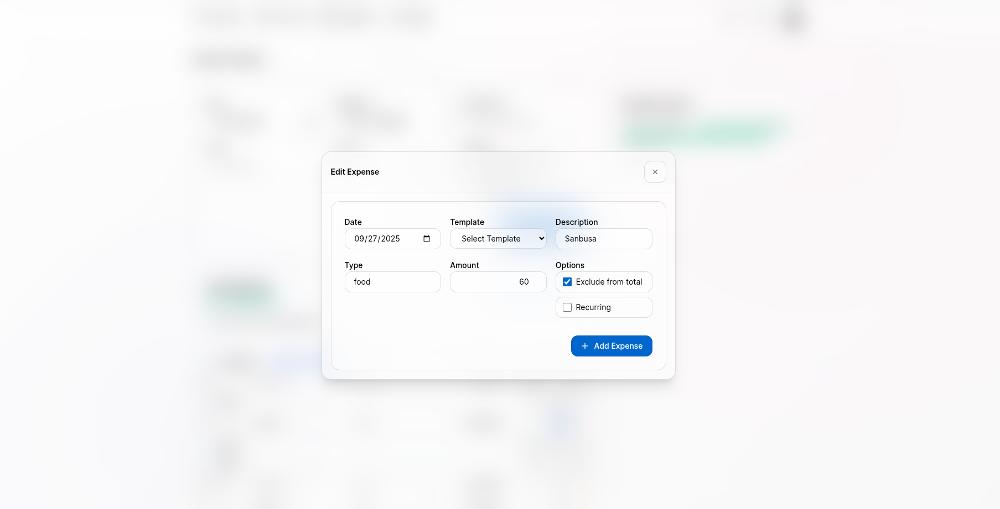

# Personal Expense Tracker

Track my expenses, manage budgets, create recurring transactions, and visualize my financial data with an intuitive and responsive interface powered by AI-assisted expense parsing.











## Features

- **AI-Powered Expense Parsing**: Use natural language to add expenses with Google Gemini AI integration - simply describe your expenses in plain English
- **Smart Expense Categorization**: Automatic expense type detection and intelligent categorization
- **Expense Tracking**: Add, edit, and delete expenses with detailed categorization
- **Recurring Expenses**: Set up automatic recurring transactions with customizable frequencies
- **Budget Management**: Create and monitor budgets with visual progress indicators across multiple time periods (weekly, monthly, multi-month, yearly)
- **Templates**: Save frequently used expense templates for quick entry
- **Export & Sync**: Export expense data to CSV or PDF formats, with Google Drive backup integration
- **User Authentication**: Secure login system with Google OAuth integration
- **Data Visualization**: Interactive charts and graphs for expense analysis
- **Theme Support**: Multiple theme options for personalized experience
- **Mobile Responsive**: Optimized interface for desktop and mobile devices with consistent grid layouts
- **Real-time Updates**: Automatic expense generation for due recurring transactions

## Tech Stack

### Frontend
- **React 19** - Modern React with hooks and concurrent features
- **TypeScript** - Type-safe JavaScript development
- **Vite** - Fast build tool and development server
- **Tailwind CSS** - Utility-first CSS framework
- **React Router** - Client-side routing
- **Axios** - HTTP client for API requests
- **Recharts** - Composable charting library
- **Lucide React** - Modern icon library
- **PapaParse** - CSV parsing and generation library
- **jsPDF** - PDF document generation library
- **html2canvas** - HTML to canvas conversion for PDF generation
- **React Toastify** - Toast notification system

### Backend
- **Node.js** - JavaScript runtime environment
- **Express.js** - Web application framework
- **MongoDB** - NoSQL database with Mongoose ODM
- **JWT** - JSON Web Token authentication
- **Passport.js** - Authentication middleware with Google OAuth
- **bcryptjs** - Password hashing
- **CORS** - Cross-origin resource sharing
- **Google Generative AI** - AI-powered natural language processing for expense parsing

## Prerequisites

Before running this application, ensure you have the following installed:

- **Node.js** (version 18 or higher)
- **MongoDB** (local installation or cloud instance)
- **pnpm** (package manager)
- **Git** (for cloning the repository)

## Installation

1. **Clone the repository:**
   ```bash
   git clone https://github.com/Yehonatal/project-expenses.git
   cd project-expenses
   ```

2. **Install dependencies for both frontend and backend:**
   ```bash
   # Install backend dependencies
   cd backend
   pnpm install

   # Install frontend dependencies
   cd ../frontend
   pnpm install
   ```

3. **Environment Setup:**

   **Backend (.env file in backend/ directory):**
   ```env
   PORT=5000
   MONGODB_URI=mongodb://localhost:27017/expense-tracker
   JWT_SECRET=your-jwt-secret-key
   GOOGLE_CLIENT_ID=your-google-client-id
   GOOGLE_CLIENT_SECRET=your-google-client-secret
   GOOGLE_API_KEY=your-google-gemini-api-key
   SESSION_SECRET=your-session-secret
   ```

   **Frontend (.env file in frontend/ directory):**
   ```env
   VITE_API_BASE_URL=http://localhost:5000/api
   ```

4. **Start MongoDB:**
   Ensure MongoDB is running on your system or update the `MONGODB_URI` to point to your MongoDB instance.

## Usage

1. **Start the backend server:**
   ```bash
   cd backend
   pnpm run dev
   ```

2. **Start the frontend development server:**
   ```bash
   cd frontend
   pnpm run dev
   ```

3. **Access the application:**
   Open your browser and navigate to `http://localhost:5173`

### Key Features Usage

- **AI-Powered Expense Entry**: Describe expenses in natural language (e.g., "Lunch at restaurant for 500 birr, taxi home for 60 birr") and the AI will automatically parse and categorize them
- **Adding Expenses**: Use the expense form to add new transactions with categories and amounts
- **Recurring Expenses**: Set up expenses that repeat automatically (daily, weekly, monthly, yearly)
- **Budget Tracking**: Create budgets for different time periods (weekly, monthly, multi-month, yearly) and monitor spending against limits with visual progress indicators
- **Templates**: Save common expense patterns for quick reuse
- **Data Analysis**: View expense summaries and trends through the dashboard

## API Documentation

### Authentication Endpoints
- `POST /api/auth/login` - User login
- `POST /api/auth/register` - User registration
- `GET /api/auth/google` - Google OAuth login
- `POST /api/auth/logout` - User logout

### AI-Powered Parsing Endpoints
- `POST /api/ai/parse-expense` - Parse natural language expense descriptions into structured data
- `POST /api/ai/parse-template` - Parse natural language template descriptions
- `POST /api/ai/parse-budget` - Parse natural language budget descriptions
- `POST /api/ai/parse-recurring` - Parse natural language recurring expense descriptions

### Expense Endpoints
- `GET /api/expenses` - Get all expenses
- `POST /api/expenses` - Create new expense
- `PUT /api/expenses/:id` - Update expense
- `DELETE /api/expenses/:id` - Delete expense
- `POST /api/expenses/generate-recurring` - Generate due recurring expenses

### Budget Endpoints
- `GET /api/budgets` - Get all budgets
- `POST /api/budgets` - Create new budget (supports weekly, monthly, multi-month, yearly types)
  - **Weekly**: `{ type: "weekly", startDate, endDate, totalBudget }`
  - **Monthly**: `{ type: "monthly", startMonth, startYear, totalBudget }`
  - **Multi-Month**: `{ type: "multi-month", startMonth, startYear, endMonth, endYear, totalBudget }`
  - **Yearly**: `{ type: "yearly", year, totalBudget }`
- `PUT /api/budgets/:id` - Update budget
- `DELETE /api/budgets/:id` - Delete budget

### Template Endpoints
- `GET /api/templates` - Get all templates
- `POST /api/templates` - Create new template
- `PUT /api/templates/:id` - Update template
- `DELETE /api/templates/:id` - Delete template
